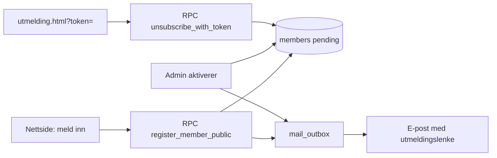

# Medlemshåndtering — plan

Prosjekt for medlemsregister i Coventry City Scandinavia-webappen.

**Status:** Steg 1–2 implementert i kode (migrering må kjøres i Supabase). Vipps bedrift / org.nr. kommer senere.

## Mål

- Melde seg inn via nettsiden
- Melde seg ut via e-post (signert lenke)
- Admin-panel for medlemshåndtering (inn/utmelding)
- Senere: kontingent via Vipps
- Personopplysninger håndtert sikkert (GDPR / RLS)

## Arkitektur

| Lag | Rolle |
|-----|--------|
| Nettside (`medlem.html`, `utmelding.html`) | Innmelding og utmelding |
| Supabase DB | `members`, `membership_payments`, `unsubscribe_tokens`, `member_mail_outbox` |
| Supabase Edge Functions | E-postutsending (Resend når konfigurert); senere Vipps |
| Admin (`/admin/` → **Medlemmer**) | Manuell inn/utmelding, aktivering, e-postkø |

## Steg

### 1. DB + RLS + admin-fane ✅ (denne leveransen)

- Tabeller, indekser, RLS (`is_admin()`)
- Offentlige RPC-er for innmelding/utmelding (ingen direkte anon-tilgang til PII)
- Admin: liste, filter, manuell innmelding, aktivering, utmelding, utmeldingslenke

### 2. Offentlig innmelding + e-postutmelding ✅ (denne leveransen)

- `medlem.html` — skjema med personvernsamtykke
- `utmelding.html` — bekreft utmelding via token
- Velkomst-/bekreftelsesmail i `member_mail_outbox` med utmeldingslenke
- Admin kan sende via mailto / markere sendt; Edge Function klar for Resend

### 3. Vipps ePayment (senere)

- Vipps for bedrift + Payment Integration
- Edge Function starter betaling (`WEB_REDIRECT` + telefon)
- Webhook → `active` + `paid_until`
- Nøkler kun i Supabase secrets

### 4. Vipps Recurring (valgfritt senere)

- Årlig avtale (`interval: YEAR`)
- Auto-fornyelse uten manuelt trekk

### 5. PUSH_MESSAGE (valgfritt)

- Admin «Send Vipps-krav» direkte til app
- Krever Vipps-godkjenning + samtykke

## Kontingent (Vipps) — kort

- **Engangs:** ePayment API med `customer.phoneNumber` (MSISDN)
- **Årlig auto:** Recurring API
- Anbefaling: start med ePayment på innmelding; Recurring når org/Vipps er på plass

## Personvern

- Minimal data: navn, e-post, mobil, land, status, betaling
- RLS: kun admin leser registeret; publikum via RPC
- Utmeldingstoken lagres som SHA-256-hash
- Outbox/audit for sporbarhet
- Personvernerklæring + databehandleravtale (Supabase) før produksjon med reelle medlemmer
- Betalingsdata hos Vipps; vi lagrer kun reference/status

## Forutsetninger utenfor kode

- [ ] Org.nr. / forening
- [ ] Vipps for bedrift
- [ ] E-postleverandør (f.eks. Resend) for automatisk utsending
- [ ] Personvernerklæring og medlemsvilkår
