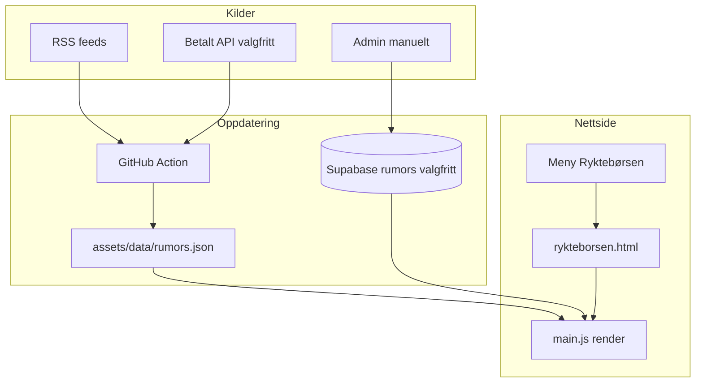

# Ryktebørsen — plan

Meny og side som samler **kun Coventry City-overgangsrykter** (innkommende, utgående og bekreftede), med fokus på **lovlig kildebruk** og enkel drift på GitHub Pages + eksisterende stack.

**Status:** Fase 0 implementert (meny + manuell kuratering). Fase 1–2 ikke startet.  
**Scope:** Kun Coventry / Sky Blues — ingen generell PL-gossip.

## Mål

- Ny meny: **Ryktebørsen** (`rykteborsen.html`)
- Vise **kun Coventry-relaterte** rykter med kilde, tidspunkt og lenke til originalen
- Hard filter: tittel/beskrivelse/kategori må treffe Coventry (se under)
- Unngå ulovlig scraping / republisering av fullartikler
- Passe inn i eksisterende mønster (statisk HTML + JS, CMS-tekster, changelog)

## Juridisk ramme (kort)

| Tillatt (anbefalt) | Unngå |
| --- | --- |
| Offentlige **RSS/Atom**-feeds der utgiver tillater headline + kort sammendrag + lenke tilbake | Scraping av HTML fra nyhetssider uten tillatelse |
| Lisensierte **data-API-er** (betalt) | Kopiere hele gossip-spalter eller artikler |
| Manuelt kuraterte korttekster skrevet av admin (egen tekst) | Framing av andres sider i iframe |
| Ren **lenkeaggregering** med tittel, kilde og deep link | Scraping av X/Twitter uten offisiell API / ToS-brudd |
| Sitatrett: korte sitater med kildehenvisning (norsk åndsverklov) — ikke erstatning for RSS-lisens | Bruke BBC-/Sky-logoer uten tillatelse |

**Praksis for oss:** Vis **overskrift + 1–2 setninger (fra feed) + kilde + lenke**. Aldri full artikkeltekst. Alltid `rel="noopener"` og tydelig «Les hos [kilde]».

## Coventry-filter (obligatorisk)

Alle automatiske treff **må** treffe minst ett av:

- Nøkkelord i tittel/beskrivelse: `Coventry`, `Sky Blues`, `CCFC`, `CBS Arena`
- Kategori/tag fra kilden: f.eks. Guardian `Coventry City`
- (Senere) spillernavn fra en Coventry-watchlist (tropp + ryktede targets)

Ingen treff → ikke vis. Generell BBC-/Sky-gossip uten Coventry-nevnelse skal **ikke** inn.

## Anbefalte kilder (kun Coventry)

### A. Gratis / lav risiko (fase 1) — prioritert rekkefølge

| Prioritet | Kilde | URL | Hvorfor | Merknad |
| --- | --- | --- | --- | --- |
| **1** | **Coventry Telegraph / CoventryLive** Football RSS | `https://www.coventrytelegraph.net/sport/football/rss.xml` | Allerede Coventry-fokus; mye transfer-LIVE og rykter | Beste gratis kilde for oss. Bruk kun tittel + kort beskrivelse + lenke |
| **1b** | CoventryLive Football News RSS | `https://www.coventrytelegraph.net/sport/football/football-news/rss.xml` | Samme familie, litt smalere | Filtrer på transfer/rumour/sign/deal i tittel |
| **2** | **Guardian Transfer window** RSS | `https://www.theguardian.com/football/transfer-window/rss` | Offentlig RSS; hadde Coventry-treff i test | Filtrer på Coventry-nøkkelord / kategori |
| **3** | Guardian Football RSS | `https://www.theguardian.com/football/rss` | Offentlig RSS | Samme Coventry-filter |
| **4** | **BBC Coventry City** team-feed | `https://feeds.bbci.co.uk/sport/football/teams/coventry-city/rss.xml` | Offisiell BBC team-feed + RSS-lisens | I praksis ofte podkast/features — lite rykter; behold som supplement |
| **5** | BBC Sport Football RSS | `https://feeds.bbci.co.uk/sport/football/rss.xml` | Lovlig RSS med attribusjon | **Kun** treff med Coventry-filter (generell feed har ofte 0 Coventry-hits) |
| **6** | Sky Sports Football RSS | `https://www.skysports.com/rss/11095` | Fungerer teknisk; transfer-innslag finnes | **Kun** Coventry-filter; uklare RSS-vilkår → bare tittel + lenke |
| — | **ccfc.co.uk** | (lenke manuelt / senere) | Bekreftede overganger | Merk som `Bekreftet` i UI |

**Ikke bruk generelle Sky-/BBC-gossip-feeder uten Coventry-filter** — de gir nesten bare PL-sladder om andre klubber.

### B. Betalte API-er (fase 2, valgfritt)

| Leverandør | Hva | Når |
| --- | --- | --- |
| **Sportmonks Transfer Rumours API** | Strukturerte rykter: spiller, klubber, sannsynlighet, kilde + deep link | Når vi vil ha Coventry-filtrert «børs» uten scraping |
| **Football Feeds (transfer rumours)** | JSON/XML med fee, probability, source | Alternativ til Sportmonks |

Betalte feeds er juridisk renest (lisens), men har kostnad og nøkkelhåndtering (GitHub Secrets / Edge Function — ikke i frontend).

### C. Ikke anbefalt som automatiske kilder

| Kilde | Hvorfor |
| --- | --- |
| Transfermarkt HTML-scraping | ToS + databasevern; skjør HTML |
| Sky Sports / The Athletic / tabloid fullside-scrape | Opphavsrett + ToS |
| Fabrizio Romano m.fl. via X-scrape | Bryter plattformens vilkår; bruk heller API/lisens eller manuell «Her we go»-post fra admin |
| Google News scraping | Bruk eventuell lisensiert News API hvis behov |

## Produktkonsept

**Ryktebørsen** = feed-kort (ikke dashboard med stats/chips).

Hvert kort:

1. Spillernavn / kort tittel  
2. Én setning (fra RSS eller admin)  
3. Kilde + publisert tid  
4. Tag: `Rykte` | `Bekreftet` | `Avvist` (admin/regel)  
5. CTA: «Les original» → ekstern lenke  

Valgfritt senere: «Coventry-filter» (toggle), troverdighet (Lav/Medium/Høy) basert på kilde-whitelist.

## Teknisk innpassing (eksisterende stack)

Statisk site + `main.js` + CMS (`site-content.default.json`) + eventuell GitHub Action (som fixtures).

### Anbefalt faseinndeling

### Fase 0 — Meny + manuell ryktebørs ✅

1. `rykteborsen.html` (mal etter `nyheter.html`)
2. Nav-lenke på **alle** HTML-sider + `nav.rumors` / `nav.visible.rumors` i CMS
3. Admin-felter for sidetekst i `admin.js` `CONTENT_SECTIONS`
4. Data: `assets/data/rumors.json` fallback + Supabase `rumor_posts` (`20260806120000_rumor_posts.sql`)
5. Admin-panel «Ryktebørsen»: tittel, korttekst, kilde, URL, tag, publisert
6. Oppdatert `changelog.json`

**Drift:** Kjør migrasjonen i Supabase før admin-CRUD virker. Uten tabell faller forsiden tilbake til tom `rumors.json`.

### Fase 1 — Automatisk Coventry-RSS (anbefalt neste)

1. Script `scripts/update-rumors.mjs` (node, som fixtures)
2. GitHub Action (oftere i transfervindu)
3. **Primærkilde:** Coventry Telegraph football RSS
4. **Supplement:** Guardian transfer-window RSS + BBC Coventry-team RSS
5. Hard **Coventry-filter** på alle treff (se over)
6. Lagre kun: `title`, `summary` (trimmet), `source`, `url`, `publishedAt`, `tag`
7. Dedup på URL; hopp over non-transfer hvis ønskelig (nøkkelord: transfer, rumour, sign, deal, loan)
8. Disclaimer + attribusjon (BBC: «From BBC Sport»)

**Sky/BBC generelle feeds** er lav prioritet — for lite Coventry-signal uten filterstøy.

### Fase 2 — Strukturert «børs» (valgfritt)

1. Sportmonks / Football Feeds (nøkkel i secret)
2. Filtrer på lag-ID Coventry City
3. Vis sannsynlighet + kilde-deep-link fra API
4. Fallback til RSS/manuelt hvis API feiler

## UI / innhold (bevar eksisterende design)

- Følg sky blue / Montserrat / eksisterende `page-hero` + `section`
- Ikke bygg et «AI-dashboard»; én liste med tydelige poster
- Skille **Nyheter** (klubbens egne) fra **Ryktebørsen** (eksterne rykter)
- Synlig disclaimer øverst: rykter er spekulasjon; bekreftede saker merkes

## Filendringer (forventet)

| Fil | Endring |
| --- | --- |
| `rykteborsen.html` | Ny side |
| Alle `*.html` med nav | Ny menylenke |
| `assets/data/site-content.default.json` | `nav.rumors`, `rumorsPage.*` |
| `assets/js/main.js` | `renderRumorsPage` |
| `assets/js/admin.js` | CMS + evt. CRUD |
| `assets/data/rumors.json` | Statisk/Action-generert feed |
| `scripts/update-rumors.mjs` | RSS → JSON (fase 1) |
| `.github/workflows/update-rumors.yml` | Schedule |
| `assets/data/changelog.json` | Brukervendt oppføring |
| Evt. `supabase/migrations/..._rumors.sql` | Hvis admin-CRUD i DB |

## Risiko og beslutninger å ta før kode

1. **Kun Coventry eller bred gossip?** Anbefaling: start Coventry-filter + manuelle «hot takes»; bred BBC-gossip som sekundær seksjon.
2. **Manuell-først vs RSS-først?** Anbefaling: Fase 0 først (1–2 dager arbeid i stacken), deretter RSS.
3. **Supabase vs JSON-fil?** JSON + Action matcher fixtures og krever ingen migrasjon; Supabase matcher Nyheter og gir admin-redigering. Hybrid: Action skriver JSON, admin kan «pinne»/overstyre i Supabase.
4. **Betalt API?** Utsett til etter at Fase 0–1 er i bruk.

## Akseptansekriterier

- [ ] Meny «Ryktebørsen» synlig og CMS-styrbar
- [ ] Siden viser liste med kilde + ekstern lenke
- [ ] Ingen fullartikler hostes lokalt
- [ ] BBC-attribusjon korrekt der relevant
- [ ] Disclaimer synlig
- [ ] Changelog oppdatert
- [ ] Fungerer på mobil og desktop i eksisterende layout

## Anbefalt neste steg

1. **Fase 0 (ferdig):** Admin legger kun inn Coventry-rykter manuelt.  
2. **Fase 1:** Start med **Coventry Telegraph RSS** + hard Coventry-filter på Guardian transfer-feed.  
3. Sky/BBC generell gossip: dropp eller streng filter — for lite Coventry-signal.
